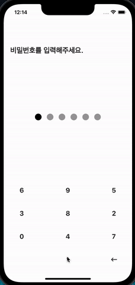
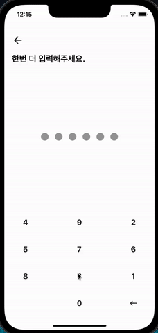

# password_submit

## 패스워드 랜덤 키패드

<br>

### 사용한 버전
 - Flutter 3.0.4
 - Dart 2.17.5

### 사용한 라이브러리
- [Get 4.6.5 (상태관리)](https://pub.dev/packages/get)

<br>

### 간단한 설명
- #### 상태관리에 필요한 데이터 관리 및 비즈니스 로직 컨트롤러
    - password_data_controller.dart <br><br>

    상태관리에 필요한 데이터 변수 생성
    ````dart
  /// 입력되는 패스워드 데이터
  RxList<String> passwordInputData = <String>[].obs;

  /// 등록될 패스워드 값
  List<String> passwordResult = [];

  /// 패스워드가 맞는지 체크하는 플래그
  Rx<bool> isPasswordCheck = true.obs;

  /// 패스워드 등록이 성공됐는지 체크하는 플래그
  Rx<bool> isComplete = false.obs;

  /// 현재 페이지 context
  late BuildContext context;
  ````
  
    상태관리에 필요한 리스너 등록 및 해제에 필요한 변수 및 메서드 생성
    ````dart
    /// 비밀번호 등록 페이지 => 패스워드 6자리 입력 체크 리스너
  late StreamSubscription<List<String>> passwordInputDataListenerAdd;

  /// 비밀번호 확인 페이지 => 패스워드 6자리 입력 체크 및 검증 리스너
  late StreamSubscription<List<String>> passwordInputDataListenerConfirm;
  
  
  /// 비밀번호 등록 페이지 => 패스워드 6자리 입력 완료시 실행되는 메서드
  void addComplete() {
    passwordResult = passwordInputData.value;
    Navigator.of(context).pushReplacementNamed(
      '/confirm',
      arguments: [passwordResult],
    );
    clearData();
  }

  /// 비밀번호 확인 페이지 => 패스워드 6자리 입력 완료시 실행되는 메서드
  void confirmComplete() {
    if (passwordResult.toString() == passwordInputData.toString()) {
      isPasswordCheck.value = true;
      Navigator.of(context).pushReplacementNamed(
        '/result',
        arguments: [passwordResult],
      );
      isComplete.value = true;
      clearData();
      passwordResult = [];
    } else {
      isPasswordCheck.value = false;
    }
    passwordInputData.clear();
  }
  
  
  /// 비밀번호 등록 페이지 => 패스워드 6자리 입력 체크 리스너
  void passwordAddListener() {
    passwordInputDataListenerAdd = passwordInputData.listen((data) {
      if (data.length == 6) {
        addComplete();
      }
    });
  }

  /// 비밀번호 확인 페이지 => 패스워드 6자리 입력 체크 및 검증 리스너
  void passwordConfirmListener() {
    passwordInputDataListenerConfirm = passwordInputData.listen((data) {
      if (data.length == 6) {
        confirmComplete();
      }
    });
  }
  
  
  /// 비밀번호 등록 페이지 리스너 메모리 해제
  void passwordAddCancel() {
    passwordInputDataListenerAdd.cancel();
  }

  /// 비밀번호 확인 페이지 리스너 메모리 해제
  void passwordConfirmCancel() {
    passwordInputDataListenerConfirm.cancel();
  }
  ````
<br>

- #### 랜덤 키패드 위젯
    - keypad_widget.dart <br><br>
    
    재료를 준비해줍니다.

    ````dart
    void initKeyPadNum() {
    /// 0 부터 9 까지의 랜덤 한 숫자를 만드는 반복문
    for (int i = 0; randomValue.length < 10; i++) {
      int rand = math.Random().nextInt(10);

      if (randomValue.contains(rand.toString())) continue;
      randomValue += num.substring(rand, rand + 1);
    }

    /// Grid 로 만든 키패드의 9번째 칸 공백을 위한 가공
    keyPadValue = '${randomValue.substring(0, 9)}@${randomValue.substring(9)}';
  }
    ````
  재료로 만든 랜덤 값들로 GridView 를 활용해서 랜덤 키패드를 만들어 주었습니다. <br>
  그리고 GridView 를 활용함으로써 숫자 키패드로 쓰지 않는 9번째 자리와 11번째 자리를 각각 조건문을 사용해 구분지어 주었습니다.

    ````dart
  GridView.builder(
        physics: const NeverScrollableScrollPhysics(),
        itemCount: 12,
        gridDelegate: const SliverGridDelegateWithFixedCrossAxisCount(
          crossAxisCount: 3,
          childAspectRatio: 1,
          mainAxisSpacing: 0,
          crossAxisSpacing: 70,
        ),
        itemBuilder: (BuildContext context, int index) {
          if (index != 9) {
            if (index != 11) {
              /// 공백 칸과 지우기 칸을 제외한 숫자 키패드
              return numKeyPadWidget(index);
            } else {
              /// 11번째 칸 지우기 키패드
              return deleteKeyPadWidget();
            }
          } else {
            /// 공백 키패드
            return const SizedBox();
          }
        },
      ),
  ````
<br>

- #### 패스워드 입력 길이? 위젯
    - password_length_widget.dart <br><br>

    패스워스 입력 데이터인 RxList 타입의 passwordInputData 를 활용해 위젯을 만들어 주었습니다.

    ````dart
  /// 6자리 회색 동그라미 로우 위젯
  Widget grayCircleRowWidget() {
    return Row(
      children: [
        for (int i = 0; i < 6; i++)
          Padding(
            padding: const EdgeInsets.all(8.0),
            child: Container(
              width: 20,
              height: 20,
              decoration: BoxDecoration(
                color: Colors.grey,
                borderRadius: BorderRadius.circular(10),
              ),
            ),
          ),
      ],
    );
  }

  /// 입력 표시 검은색 동그라미 로우 위젯
  Widget blackCircleRowWidget() {
    return Row(
      children: widget.passwordInputData
          .map((e) => Padding(
                padding: const EdgeInsets.all(8.0),
                child: Container(
                  width: 20,
                  height: 20,
                  decoration: BoxDecoration(
                    color: Colors.black,
                    borderRadius: BorderRadius.circular(10),
                  ),
                ),
              ))
          .toList(),
    );
  }
  ````
  
<br>

- #### 패스워드 등록 및 확인 스크린
  - password_add_screen / password_confirm_screen
<br><br>
   
  passwordInputData 의 length 값을 활용해 만든 리스너를 각 스크린에 등록 및 해제

  ````dart
  void listener() {
    /// 현재 스크린 context 가져오기
    passwordDataController.setContext(context);
    /// 리스너 등록
    passwordDataController.passwordAddListener();
  }
  
  @override
  void initState() {
    listener();
    super.initState();
  }
  
  @override
  void dispose() {
    /// 리스너 해제
    passwordDataController.passwordAddCancel();
    super.dispose();
  }
  ````
  
    keypad_widget 과 password_length_widget 으로 화면 그려주기

    ````dart
  @override
  Widget build(BuildContext context) {
    return Obx(
      () => Container(
        color: Colors.white,
        child: SafeArea(
          child: Scaffold(
            backgroundColor: Colors.white,
            body: Padding(
              padding: const EdgeInsets.only(top: 30, left: 20, right: 20),
              child: Column(
                children: [
                  const SizedBox(
                    height: 50,
                  ),
                  titleWidget(),
                  SizedBox(
                    height: 0,
                    child: Text(
                        passwordDataController.passwordInputData.toString()),
                  ),
                  /// 패스워드 입력 길이 로우 위젯
                  PasswordLengthWidget(
                    passwordInputData: passwordDataController.passwordInputData,
                  ),
                  /// 랜덤 키패드 위젯
                  KeyPadWidget(
                    passwordInputData: passwordDataController.passwordInputData,
                  ),
                ],
              ),
            ),
          ),
        ),
      ),
    );
  }
  ````
<br><br>

### 결과화면

- #### password_add_screen
</img>
<br><br>

- #### password_confirm_screen / password_result_screen
</img>
